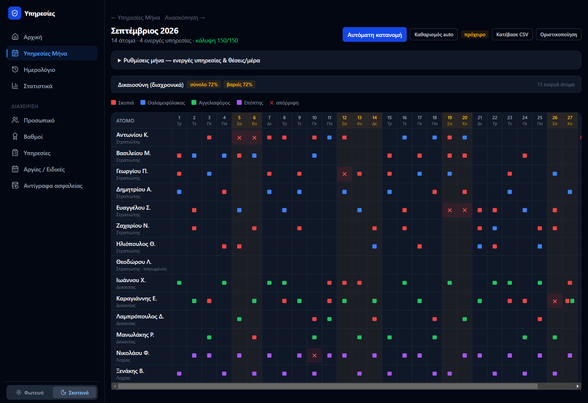
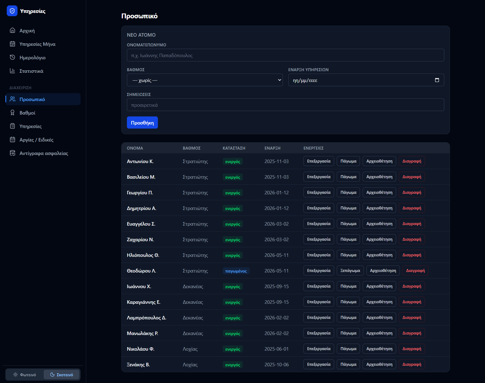
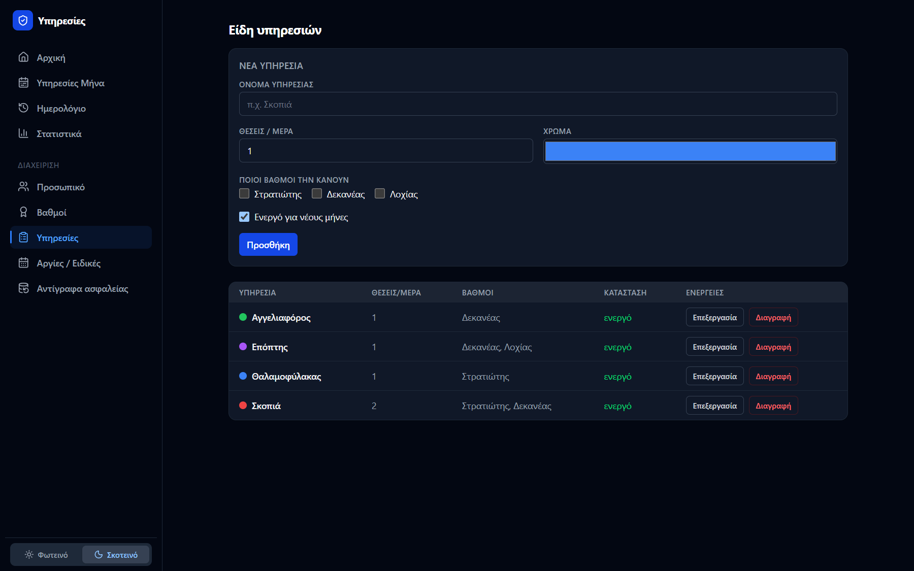
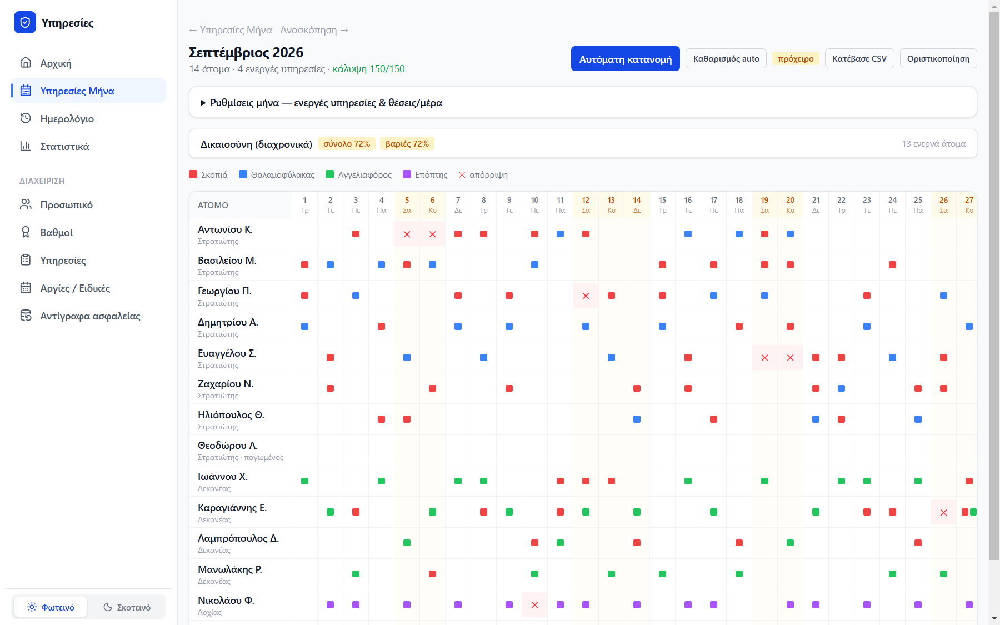
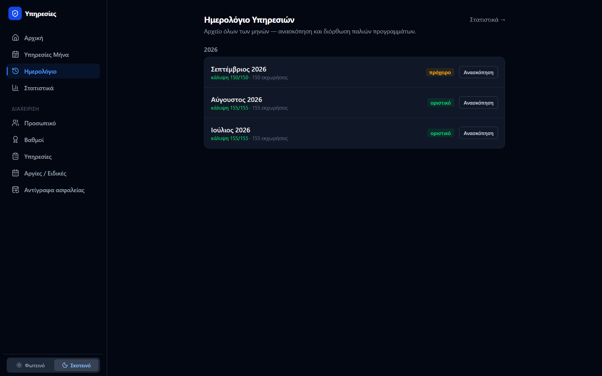
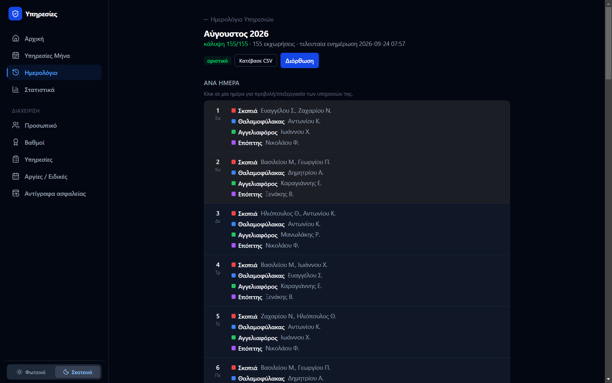
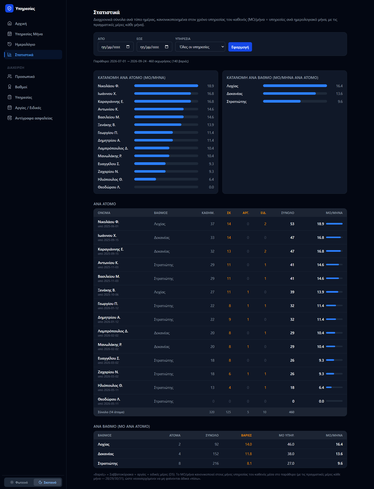
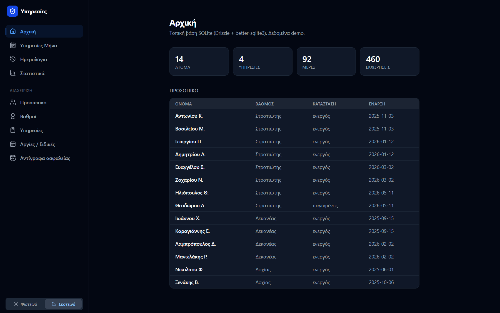

# duty-scheduler

> Αυτοματοποίηση εκχώρησης στρατιωτικών υπηρεσιών (βαρδιών) μέσα στον μήνα, με δίκαιη
> κατανομή, σεβασμό στις προτιμήσεις και διαχρονικά στατιστικά ανά άτομο/βαθμό.

**Κατάσταση:** ✅ Ολοκληρωμένο — **v0.1.0**, desktop εφαρμογή για Windows
([Releases](https://github.com/oikonomouvasilis/duty-scheduler/releases/latest)).



> Όλα τα στιγμιότυπα έχουν **φανταστικά δεδομένα** (`npm run db:demo`).

---

## Εγκατάσταση (Windows)

1. Κατέβασε το `Duty Scheduler Setup 0.1.0.exe` από τα
   [Releases](https://github.com/oikonomouvasilis/duty-scheduler/releases/latest).
2. Τρέξ' το και ακολούθησε τον installer. Αν εμφανιστεί προειδοποίηση SmartScreen
   (ο installer δεν είναι ψηφιακά υπογεγραμμένος): **«Περισσότερες πληροφορίες» → «Εκτέλεση οπωσδήποτε»**.
3. Άνοιξε το **Duty Scheduler** από το μενού Έναρξη.

Δεν χρειάζεται internet, Node ή οτιδήποτε άλλο. Το ίδιο αρχείο εγκαθίσταται σε
οποιονδήποτε υπολογιστή Windows (π.χ. από USB).

**Δεδομένα:** αποθηκεύονται τοπικά στο `%APPDATA%\duty-scheduler\duty-scheduler.db`.
Κάθε υπολογιστής ξεκινά με κενή βάση· τα δεδομένα διατηρούνται σε αναβαθμίσεις.
Για μεταφορά σε άλλον υπολογιστή: **Διαχείριση → Αντίγραφα ασφαλείας** (λήψη αντιγράφου) και
αντικατάσταση του παραπάνω αρχείου στον νέο υπολογιστή (με την εφαρμογή κλειστή).

## Οδηγίες χρήσης

Προτεινόμενη σειρά την πρώτη φορά:

1. **Διαχείριση → Βαθμοί** — πρόσθεσε τους βαθμούς.
2. **Διαχείριση → Υπηρεσίες** — όρισε τα είδη υπηρεσιών (ποιοι βαθμοί τις εκτελούν, πόσες θέσεις/μέρα, χρώμα).
3. **Διαχείριση → Προσωπικό** — πρόσθεσε τα άτομα με βαθμό και **ημερομηνία έναρξης** υπηρεσιών
   (μετράει στη δικαιοσύνη). «Πάγωμα» = προσωρινή εξαίρεση από τις εκχωρήσεις.
4. **Διαχείριση → Αργίες / Ειδικές** — δήλωσε αργίες και ειδικές μέρες (μετρούν ως «βαριές»).

| Προσωπικό | Είδη υπηρεσιών |
|---|---|
|  |  |

Κάθε μήνα:

1. **Υπηρεσίες Μήνα** → **Νέος μήνας**.
2. Στον πίνακα (άτομα × μέρες) κάνε κλικ σε κουτί για να **απορρίψεις** μέρα (δήλωση ατόμου
   ότι δεν μπορεί — ✕) ή να **εκχωρήσεις** υπηρεσία χειροκίνητα.
3. **Αυτόματη κατανομή** — το πρόγραμμα γεμίζει τον μήνα δίκαια, σεβόμενο τις απορρίψεις και
   το ιστορικό του καθενός. Το πάνελ «Δικαιοσύνη» δείχνει την ισορροπία.
4. Διόρθωσε χειροκίνητα ό,τι χρειάζεται και πάτα **Οριστικοποίηση**. **Κατέβασε CSV** για Excel.



Επιπλέον:

- **Ημερολόγιο** — αρχείο όλων των μηνών· **Ανασκόπηση** ανά ημέρα και **Διόρθωση** παλιού μήνα.

  | Ημερολόγιο | Ανασκόπηση μήνα |
  |---|---|
  |  |  |

- **Στατιστικά** — σύνολα και ΜΟ/μήνα ανά άτομο και βαθμό, ανά τύπο ημέρας, με φίλτρα
  διαστήματος και υπηρεσίας. Το ΜΟ/μήνα λαμβάνει υπόψη πότε ξεκίνησε ο καθένας.

  

- **Αρχική** — σύνοψη (άτομα, υπηρεσίες, εκχωρήσεις).

  

- **Φωτεινό / Σκοτεινό** θέμα από το κάτω μέρος του μενού.

---

## Στόχος

Στη μονάδα, άτομα διαφορετικών βαθμών εκτελούν διαφορετικά είδη υπηρεσιών (το καθένα
ανάλογα με τον βαθμό του). Το πρόγραμμα:

1. **Μοιράζει** τα άτομα σε υπηρεσίες μέσα στον μήνα με **ισόποσο** αριθμό υπηρεσιών,
   λαμβάνοντας υπόψη τις **προτιμήσεις/δηλώσεις** του καθενός.
2. **Κρατά διαχρονικά στατιστικά** ώστε να μην αδικείται κανείς με το πέρασμα του χρόνου.

Η εφαρμογή τρέχει **τοπικά** στον υπολογιστή και χρησιμοποιεί **SQLite** (αρχείο βάσης
στον δίσκο) για τη μόνιμη αποθήκευση ιστορικών στοιχείων (βλ. [DECISIONS.md](docs/DECISIONS.md) D9).

---

## Κομμάτια της εφαρμογής

### 1. Υπηρεσίες Μήνα
Πίνακας σαν ημερολόγιο:
- **Στήλες:** όλες οι μέρες του μήνα.
- **Γραμμές:** τα άτομα.
- Με **κλικ** σε κουτί:
  - «Απόρριψη» κουτιού → το άτομο έχει δηλώσει να **μην** κάνει υπηρεσία εκείνη τη μέρα.
  - Εισαγωγή/εκχώρηση **μίας ή περισσότερων υπηρεσιών** που θα κάνει το άτομο εκείνη τη μέρα (multi-select, αυτόματα ή χειροκίνητα).
- **Φίλτρα/ρυθμίσεις:** καθορισμός τύπων υπηρεσιών και **πόσες πρέπει να γίνονται κάθε μέρα**.

### 2. Ημερολόγιο Υπηρεσιών
- **Επεξεργάσιμα στιγμιότυπα** όλων των προηγούμενων μηνών/πινάκων.
- Άνοιγμα παλιού μήνα, διόρθωση, αποθήκευση νέας έκδοσης.

### 3. Στατιστικά
- **ΜΟ ανά τύπο ημέρας** (καθημερινές / Σαββατοκύριακα / αργίες / ειδικές μέρες) για κάθε άτομο.
- **ΜΟ ανά βαθμό.**
- **Αριθμός υπηρεσιών** ανά κατηγορία ημέρας και συνολικά, σε πίνακα ανά άτομο.
- **Φίλτρα:** χρονικό διάστημα, τύπος υπηρεσίας, και **από πότε ξεκίνησε** ο καθένας να κάνει υπηρεσίες.

### 4. Επεξεργασία (διαχείριση)
- Εισαγωγή/επεξεργασία **λιστών ατόμων**: προσθήκη, αφαίρεση, **«πάγωμα»** (προσωρινή εξαίρεση).
- Επεξεργασία **ειδών υπηρεσιών** (ποια ισχύουν, ανά ποιους βαθμούς, πόσες/μέρα).

---

## Tech stack

| Στρώμα | Τεχνολογία |
|--------|-----------|
| Framework | **Next.js** (App Router) |
| Γλώσσα | **TypeScript** |
| UI / styling | **Tailwind CSS** |
| Βάση | **SQLite** (αρχείο τοπικά) μέσω **Drizzle ORM** (`better-sqlite3`) |
| Hosting | **Τοπικά** (single-machine· χωρίς cloud — βλ. D9) |
| Desktop | **Electron** + NSIS installer (`electron-builder`) |

---

## Δομή

```
duty-scheduler/
├── app/                 # σελίδες (Next.js App Router): schedule, history, stats, admin
├── components/, lib/    # UI components, αλγόριθμος κατανομής, στατιστικά, helpers
├── db/                  # Drizzle schema, σύνδεση, migrate/seed scripts
├── drizzle/             # SQL migrations
├── electron/            # desktop εφαρμογή: main process + build script
└── docs/                # SCHEMA, ROADMAP, DECISIONS
```

## Ανάπτυξη

Απαιτεί Node 22+. Η βάση είναι **τοπικό αρχείο SQLite** — δεν χρειάζονται cloud keys ούτε
internet. Η διαδρομή ορίζεται στο `.env.local` (`DATABASE_PATH`, βλ. [`.env.example`](.env.example)).
Το **αρχείο της βάσης δεν ανεβαίνει ποτέ στο repo** (είναι στο `.gitignore`).

```bash
npm install
npm run db:migrate      # δημιουργία πινάκων
npm run db:seed         # (προαιρετικά) δοκιμαστικά δεδομένα
npm run dev             # http://localhost:3000
```

**Κατασκευή του installer:** `npm run electron:build` → `dist-electron/Duty Scheduler Setup <έκδοση>.exe`.
Αν ο φάκελος του project έχει μη-ASCII χαρακτήρες (π.χ. ελληνικά), το script χτίζει αυτόματα
από αντίγραφο στο `%TEMP%` (το Turbopack δεν υποστηρίζει τέτοια paths). Λεπτομέρειες στα
σχόλια του [`electron/build.mjs`](electron/build.mjs).

## Ασφάλεια & απόρρητο

Το repository είναι **private**. Κανένα πραγματικό όνομα ή δεδομένο **δεν** αποθηκεύεται
μέσα στο repo — μόνο στο τοπικό αρχείο βάσης, που **εξαιρείται** από το git.

Αφού όλα μένουν **τοπικά στον υπολογιστή** (όχι cloud), **επιτρέπονται πραγματικά ονόματα
προσωπικού** στη βάση (βλ. [DECISIONS.md](docs/DECISIONS.md) D9 — αντικατέστησε τα
ψευτοδεδομένα του D8). Κρίσιμη προϋπόθεση: το αρχείο `*.db` μένει εκτός git. Αν ποτέ η
εφαρμογή χρειαστεί να βγει online ή να την προσπελαύνουν πολλοί, θα ξαναμπεί το θέμα
auth/πρόσβασης (βλ. D6).

## Τεκμηρίωση

- 📐 [Πρόταση schema βάσης](docs/SCHEMA.md)
- 🗺️ [Roadmap / φάσεις](docs/ROADMAP.md)
- 🧭 [Αποφάσεις & ανοιχτά ερωτήματα](docs/DECISIONS.md)
